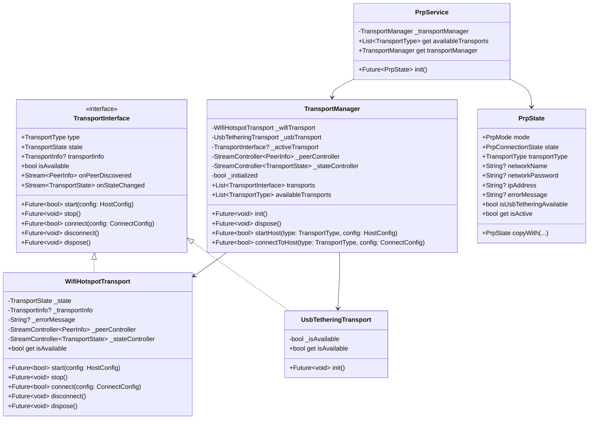
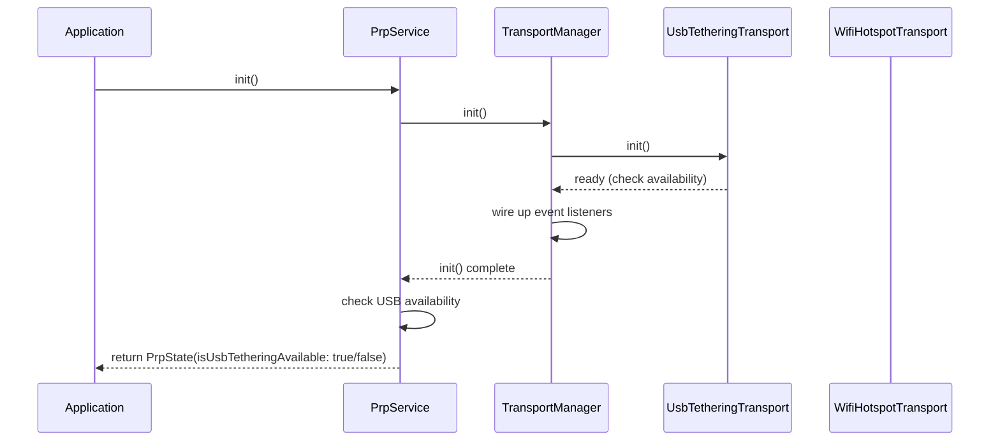
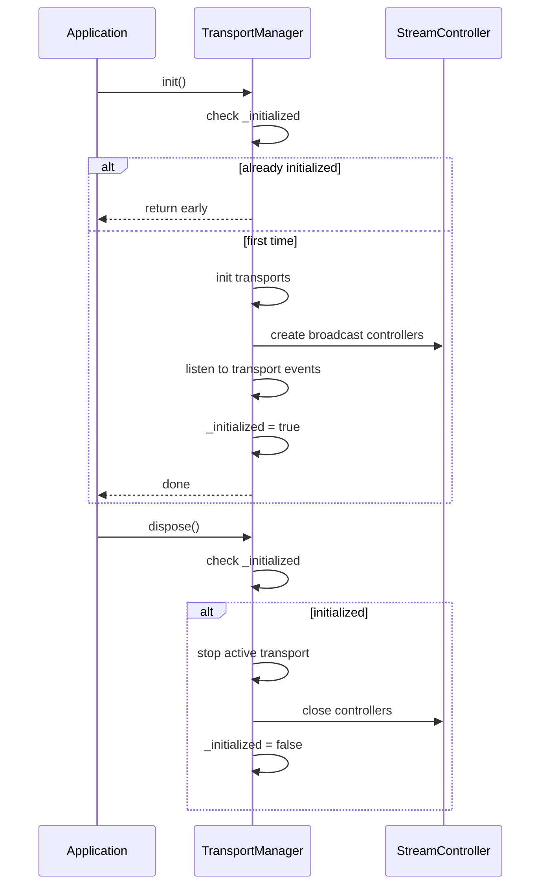
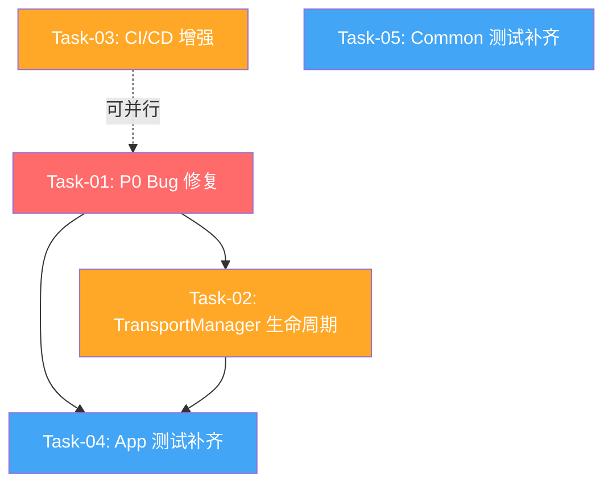

# LocalSend Fork 稳定性加固 - 系统架构设计 + 任务分解

> **架构师**: 高见远 (Bob)  
> **日期**: 2025-07-15  
> **项目**: LocalSend Fork 稳定性加固  
> **仓库**: `/workspace/localsend`

---

## Part A: 系统设计

### 1. 实现方案

#### F-001: 统一 Flutter 版本

**问题分析**:
- `.fvmrc`: `3.38.10`（本地开发用）
- `app/pubspec.yaml`: `^3.25.0`（允许 3.25.0+）
- CI 所有 workflow: `3.35.6`（实际构建用）

**方案**: 统一到 **Flutter 3.35.6**

**理由**:
1. CI 是权威来源（实际构建环境），应作为基准
2. `3.35.6` 是 stable 渠道的稳定版本
3. `.fvmrc` 的 `3.38.10` 可能是本地误配或开发分支版本
4. `pubspec.yaml` 的 `^3.25.0` 约束过于宽松，应精准锁定

**改动点**:
- `.fvmrc`: `"flutter": "3.35.6"`
- `app/pubspec.yaml`: `flutter: ">=3.35.6 <4.0.0"` 或精确 `flutter: 3.35.6`
- 建议保持 `^3.25.0` 兼容但加注释说明 CI 使用 `3.35.6`

---

#### F-002: `WifiHotspotTransport.isAvailable` 硬编码 true

**问题分析**:
第 39 行 `bool get isAvailable => true;` 在非 Android 平台调用 MethodChannel 会 crash。

**方案**: 平台检测 + 异常兜底

```dart
@override
bool get isAvailable {
  try {
    return Platform.isAndroid; // 目前只有 Android 实现
  } catch (e) {
    _logger.warning('isAvailable check failed: $e');
    return false;
  }
}
```

**改动点**:
- `app/lib/util/transport/wifi_hotspot_transport.dart` 第 39 行
- 需 import `dart:io'` 用于 `Platform.isAndroid`

---

#### F-003: `PrpService.init()` 竞态条件

**问题分析**:
第 102-111 行 `init()` 中 `_transportManager.init().then(...)` 未 await，导致：
1. `init()` 返回 `PrpState()` 时，USB 可用性检测可能仍未完成
2. UI 可能在 `isUsbTetheringAvailable` 更新前渲染

**方案**: 转为 `async` + `await`

```dart
@override
Future<PrpState> init() async {
  await _transportManager.init();
  final isUsbAvailable = _transportManager.availableTransports.contains(TransportType.usbTethering);
  return PrpState(
    isUsbTetheringAvailable: isUsbAvailable,
  );
}
```

**注意**: Refena 的 `ReduxNotifier.init()` 支持返回 `Future<State>`，框架会自动 await。

**改动点**:
- `app/lib/provider/network/prp_provider.dart` 第 101-111 行

---

#### F-004: TransportManager StreamController 生命周期

**问题分析**:
`TransportManager` 的 `_peerController` 和 `_stateController` 是 broadcast controller，但：
1. 没有 `onCancel` 回调清理资源
2. `dispose()` 调用时机不清晰（谁来调用？）
3. 多次 `init()` 会导致事件重复订阅

**方案**: 单例 + 引用计数 + 懒初始化

```dart
class TransportManager {
  bool _initialized = false;
  
  Future<void> init() async {
    if (_initialized) {
      _logger.warning('TransportManager already initialized');
      return;
    }
    // ... 现有初始化逻辑
    _initialized = true;
  }
  
  Future<void> dispose() async {
    if (!_initialized) return;
    // ... 清理逻辑
    _initialized = false;
  }
}
```

**改动点**:
- `app/lib/util/transport/transport_manager.dart` 添加 `_initialized` 标志
- `prp_provider.dart` 在 `dispose()` 中调用 `_transportManager.dispose()`

---

#### F-005: CI/CD 版本号校验和健壮性检查

**现有问题**:
1. `ci.yml` 已有 pubspec vs Inno Setup 版本校验，但缺少：
   - pubspec.yaml 版本格式验证（应包含 `+buildNumber`）
   - CHANGELOG.md 版本一致性检查
   - 多 workflow 间版本环境变量同步检查

**方案**: 添加 version-check 脚本 + CI step

新增 `.github/scripts/version_check.sh`:
```bash
#!/bin/bash
set -e

# 1. 检查 pubspec.yaml 版本格式
VERSION_LINE=$(grep '^version: ' app/pubspec.yaml)
if ! echo "$VERSION_LINE" | grep -qE 'version: [0-9]+\.[0-9]+\.[0-9]+\+[0-9]+'; then
  echo "❌ pubspec.yaml version format invalid. Expected: x.y.z+build"
  exit 1
fi

# 2. 检查所有 workflow 的 FLUTTER_VERSION 一致性
FLUTTER_VERSIONS=$(grep -r 'FLUTTER_VERSION:' .github/workflows/ | awk '{print $2}' | sort -u)
if [ $(echo "$FLUTTER_VERSIONS" | wc -l) -gt 1 ]; then
  echo "❌ FLUTTER_VERSION inconsistent across workflows:"
  echo "$FLUTTER_VERSIONS"
  exit 1
fi

echo "✅ Version checks passed"
```

**改动点**:
- 新增 `.github/scripts/version_check.sh`
- 修改 `.github/workflows/ci.yml` 添加 version-check step

---

### 2. 文件清单

#### 类别 A: Bug 修复文件

```
.fvmrc                                                            # F-001: 修改 Flutter 版本
app/pubspec.yaml                                                  # F-001: 修改 flutter 约束
app/lib/util/transport/wifi_hotspot_transport.dart                 # F-002: 修复 isAvailable
app/lib/provider/network/prp_provider.dart                         # F-003: 修复 init() 竞态
app/lib/util/transport/transport_manager.dart                      # F-004: 生命周期管理
```

#### 类别 B: CI 配置文件

```
.github/workflows/ci.yml                                          # F-005: 添加 version-check
.github/scripts/version_check.sh                                  # F-005: 新增版本校验脚本
```

#### 类别 C: 测试新文件（P2）

```
app/test/unit/provider/network/nearby_devices_provider_test.dart   # F-007: 补齐测试
app/test/unit/provider/network/send_provider_test.dart             # F-007: 补齐测试
app/test/unit/provider/network/server/server_provider_test.dart    # F-007: 补齐测试
app/test/unit/provider/network/scan_facade_test.dart              # F-007: 补齐测试
app/test/unit/util/transport/transport_manager_test.dart          # F-007: 补齐测试
app/test/unit/util/transport/wifi_hotspot_transport_test.dart     # F-007: 补齐测试
common/test/unit/isolate/isolate_test.dart                       # F-008: 补齐测试
common/test/unit/task/discovery/discovery_test.dart              # F-008: 补齐测试
common/test/unit/task/upload/upload_test.dart                    # F-008: 补齐测试
common/test/unit/model/dto/dto_test.dart                         # F-008: 补齐测试
```

---

### 3. 数据结构与接口

由于本项目主要是 Bug 修复和测试补齐，没有新的核心数据结构。以下是关键类的 Mermaid 类图：



---

### 4. 程序调用流程

#### 关键流程 1: PrpService 初始化（修复竞态后）



#### 关键流程 2: TransportManager 生命周期



---

### 5. 任何不明确之处

1. **F-001 Flutter 版本选择**:
   - 建议统一到 `3.35.6`（CI 版本），但需确认 `.fvmrc` 的 `3.38.10` 是否有特殊原因
   - 如果 `3.38.10` 是故意使用非 stable 版本，则需反向统一 CI 到 `3.38.10`

2. **F-004 TransportManager 生命周期**:
   - 当前 `TransportManager` 是 `PrpService` 的成员变量（每次创建 `PrpService` 都新实例）
   - 是否需要改为单例（全局共享）？目前看不需要，但需确认 `PrpService` 是否会被多次实例化

3. **测试策略**:
   - `F-007` 和 `F-008` 的测试是纯单元测试（mock）还是集成测试？
   - 建议先写纯单元测试，Refena 的 `ReduxProvider` 测试可用 `RefenaScope` 或 `mockito`

---

## Part B: 任务分解

### 6. 依赖包确认

**现有 dev_dependencies** (app):
- `mockito: 5.5.0` ✅ 已使用
- `test: ^1.26.2` ✅ 已使用
- `build_runner: 2.7.1` ✅ 已使用

**建议**:
- 保持 `mockito`（项目已使用，有 `mocks.dart` + `mocks.mocks.dart`）
- 不需要新增 `mocktail`（与 mockito API 不兼容）
- 不需要新增其他测试库

**common 包**:
- 已有 `test: ^1.21.0`
- 无需新增依赖

---

### 7. 任务列表（按依赖顺序排列）

#### Task-01: P0 Bug 修复（F-001 + F-002 + F-003）

**任务描述**:
修复三个 P0 关键 Bug：
1. 统一 Flutter 版本到 `3.35.6`
2. 修复 `WifiHotspotTransport.isAvailable` 硬编码 true
3. 修复 `PrpService.init()` 竞态条件

**源文件**:
- `.fvmrc`
- `app/pubspec.yaml`
- `app/lib/util/transport/wifi_hotspot_transport.dart`
- `app/lib/provider/network/prp_provider.dart`

**依赖**: 无

**优先级**: P0

**验收条件**:
- [ ] `.fvmrc` 版本改为 `3.35.6`
- [ ] `WifiHotspotTransport.isAvailable` 在 Android 返回 true，其他平台返回 false
- [ ] `PrpService.init()` 正确 await `TransportManager.init()`
- [ ] 非 Android 平台不再因 MethodChannel 调用 crash
- [ ] 所有现有测试通过 (`flutter test`)

**预估复杂度**: M

---

#### Task-02: TransportManager 生命周期管理（F-004）

**任务描述**:
增强 `TransportManager` 的健壮性：
1. 添加 `_initialized` 标志防止重复初始化
2. 在 `PrpService.dispose()` 中调用 `TransportManager.dispose()`
3. 确保 StreamController 正确关闭

**源文件**:
- `app/lib/util/transport/transport_manager.dart`
- `app/lib/provider/network/prp_provider.dart`

**依赖**: Task-01

**优先级**: P1

**验收条件**:
- [ ] `TransportManager.init()` 重复调用不会重复订阅事件
- [ ] `TransportManager.dispose()` 正确清理资源
- [ ] `PrpService` 的 `dispose()` 调用 `_transportManager.dispose()`
- [ ] 所有现有测试通过

**预估复杂度**: M

---

#### Task-03: CI/CD 增强（F-005）

**任务描述**:
增强 CI 健壮性：
1. 创建 `.github/scripts/version_check.sh`
2. 在 `ci.yml` 中添加 version-check step
3. 校验所有 workflow 的 `FLUTTER_VERSION` 一致性

**源文件**:
- `.github/scripts/version_check.sh` (新建)
- `.github/workflows/ci.yml`

**依赖**: 无（可与 Task-01 并行）

**优先级**: P1

**验收条件**:
- [ ] `version_check.sh` 可执行并通过测试
- [ ] `ci.yml` 添加 version-check step
- [ ] 故意破坏版本一致性时 CI 失败
- [ ] CI 所有 job 通过

**预估复杂度**: S

---

#### Task-04: App 核心模块测试补齐（F-007）

**任务描述**:
为 `app` 包的核心模块添加单元测试：
1. `nearby_devices_provider.dart`
2. `send_provider.dart`
3. `server_provider.dart`
4. `scan_facade.dart`
5. `transport_manager.dart`
6. `wifi_hotspot_transport.dart`

**源文件** (新建):
- `app/test/unit/provider/network/nearby_devices_provider_test.dart`
- `app/test/unit/provider/network/send_provider_test.dart`
- `app/test/unit/provider/network/server/server_provider_test.dart`
- `app/test/unit/provider/network/scan_facade_test.dart`
- `app/test/unit/util/transport/transport_manager_test.dart`
- `app/test/unit/util/transport/wifi_hotspot_transport_test.dart`

**依赖**: Task-01, Task-02

**优先级**: P2

**验收条件**:
- [ ] 每个测试文件至少覆盖主要状态转换
- [ ] 使用 `mockito` 生成 mocks（更新 `mocks.dart`）
- [ ] 测试覆盖率 > 60%（针对被测模块）
- [ ] `flutter test` 所有测试通过

**预估复杂度**: L

---

#### Task-05: Common 包测试补齐（F-008）

**任务描述**:
为 `common` 包添加单元测试：
1. `isolate/` 模块
2. `task/discovery/` 模块
3. `task/upload/` 模块
4. `model/dto/` 解析模块

**源文件** (新建):
- `common/test/unit/isolate/isolate_test.dart`
- `common/test/unit/task/discovery/discovery_test.dart`
- `common/test/unit/task/upload/upload_test.dart`
- `common/test/unit/model/dto/dto_test.dart`

**依赖**: 无（可独立进行）

**优先级**: P2

**验收条件**:
- [ ] 每个测试文件覆盖主要函数和边界情况
- [ ] `dart test` 所有测试通过
- [ ] 测试覆盖率 > 50%（针对被测模块）

**预估复杂度**: L

---

### 8. 共享知识（跨文件约定）

#### 测试命名规范
```dart
// 文件命名: <module>_test.dart
// 测试分组: group('<ClassName>', () { ... })
// 测试用例: test('should ... when ...', () { ... })

group('TransportManager', () {
  test('should initialize only once when called multiple times', () async {
    // ...
  });
});
```

#### Mock 约定
- 使用 `mockito` 的 `@GenerateMocks` 注解
- 在 `app/test/mocks.dart` 中集中声明需要的 mocks
- 运行 `dart run build_runner build` 生成 `mocks.mocks.dart`
- Mock 文件名统一用 `mocks.dart` / `mocks.mocks.dart`

#### Import 路径约定
```dart
// 相对导入用于测试文件
import '../../helpers.dart';

// 绝对导入用于 lib 文件
import 'package:localsend_app/util/transport/transport_manager.dart';
```

#### 日志约定
- 使用 `Logger('ClassName')` 声明 logger
- 日志级别: `fine`（调试）, `info`（关键操作）, `warning`（可恢复错误）, `severe`（不可恢复错误）

---

### 9. 任务依赖图



**说明**:
- **Task-01** 是阻塞项，必须最先完成
- **Task-03** 可独立进行（不需等 Task-01 完成）
- **Task-04** 依赖 Task-01 和 Task-02（需测修复后的代码）
- **Task-05** 可完全独立进行

---

## 附录: 关键代码片段

### A. 修复后的 `WifiHotspotTransport.isAvailable`

```dart
import 'dart:io'; // 新增

@override
bool get isAvailable {
  try {
    // 目前只有 Android 平台实现了 MethodChannel 调用
    // 其他平台调用 _channel 会导致 MissingPluginException
    return Platform.isAndroid;
  } catch (e) {
    _logger.warning('Failed to check platform: $e');
    return false;
  }
}
```

### B. 修复后的 `PrpService.init()`

```dart
@override
Future<PrpState> init() async {
  // 等待 TransportManager 初始化完成
  await _transportManager.init();
  
  // 现在可以安全地检查 USB 可用性
  final isUsbAvailable = _transportManager.availableTransports.contains(TransportType.usbTethering);
  
  _logger.info('PrpService initialized. USB tethering available: $isUsbAvailable');
  
  return PrpState(
    isUsbTetheringAvailable: isUsbAvailable,
  );
}

@override
Future<void> dispose() async {
  await _transportManager.dispose();
  super.dispose();
}
```

### C. 增强后的 `TransportManager`

```dart
class TransportManager {
  bool _initialized = false;
  
  Future<void> init() async {
    if (_initialized) {
      _logger.warning('TransportManager already initialized, skipping');
      return;
    }
    
    _logger.info('Initializing transport manager');
    await _usbTransport.init();
    
    // 防止重复订阅
    if (!_initialized) {
      _wifiTransport.onPeerDiscovered.listen((peer) => _peerController.add(peer));
      _wifiTransport.onStateChanged.listen((state) {
        if (_activeTransport == _wifiTransport) {
          _stateController.add(state);
        }
      });
      
      _usbTransport.onPeerDiscovered.listen((peer) => _peerController.add(peer));
      _usbTransport.onStateChanged.listen((state) {
        if (_activeTransport == _usbTransport) {
          _stateController.add(state);
        }
      });
    }
    
    _initialized = true;
    _logger.info('Transport manager initialized');
  }
  
  Future<void> dispose() async {
    if (!_initialized) {
      _logger.warning('TransportManager not initialized, skipping dispose');
      return;
    }
    
    _logger.info('Disposing transport manager');
    await stopActive();
    await _wifiTransport.dispose();
    await _usbTransport.dispose();
    
    if (!_peerController.isClosed) {
      await _peerController.close();
    }
    if (!_stateController.isClosed) {
      await _stateController.close();
    }
    
    _initialized = false;
    _logger.info('Transport manager disposed');
  }
}
```

---

## 总结

| 任务 ID | 任务名称 | 优先级 | 复杂度 | 依赖 | 预计工时 |
|---------|---------|--------|--------|------|---------|
| T01 | P0 Bug 修复 | P0 | M | 无 | 2-3h |
| T02 | TransportManager 生命周期 | P1 | M | T01 | 2-3h |
| T03 | CI/CD 增强 | P1 | S | 无 | 1-2h |
| T04 | App 核心模块测试补齐 | P2 | L | T01, T02 | 4-6h |
| T05 | Common 包测试补齐 | P2 | L | 无 | 3-4h |

**总预计工时**: 12-18 小时

**建议执行顺序**:
1. **第 1 天**: Task-01 + Task-03（可并行）
2. **第 2 天**: Task-02 + Task-05（可并行）
3. **第 3 天**: Task-04（依赖 T01+T02 的稳定性）

---

**文档版本**: v1.0  
**最后更新**: 2025-07-15  
**后续行动**: 将任务录入项目管理工具，指派开发人员
